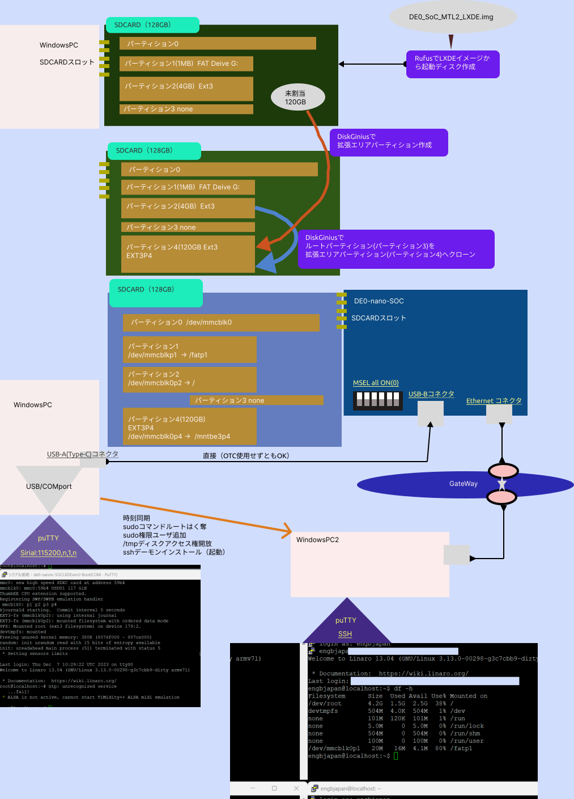

# アプローチを変更！！extlinux機構で拡張エリアからLinuxカーネルを起動する。

## まず、別のSDCARD（32GB)へWindowPC（SDCARDスロット有りを私は利用）でextlinuxを利用したイメージから起動ディスクを`Rufus`で作成
- ブートイメージの取得参照ページ
　https://www.rocketboards.org/foswiki/Documentation/CycloneVSoCGSRD#HPSBootFlow  
  から、`https://releases.rocketboards.org/2022.11/gsrd/c5_gsrd/sdimage.tar.gz`をPCでDLしgunzip->tar解凍  
  - そして、解凍して得たイメージファイル名を`gsrd-console-image-cyclone5.wic`から`sdimage.img`へ変更

  

  - Rufusで起動ディスク作成

     

    

    
    

    

## 次に、WindowsPCエクスプローラーにて参照出来るBootディスクパーティション(FAT)からWindowPCの任意ディレクトリへコピー
- 任意のディレクトリへコピー

  

  

  
  

  - そして中身を見る

    
    
---
- **この超解釈**
    > Bootパーティション（パーティション番号1であり、FATフォーマット）に`extlinux`ディレクトリが有れば、  
    >  その中の`extlinux.conf`を参照し、  
    >  `extlinux`ディレクトリ直下のカーネルイメージ`zImage`を`/dev/mmcblok0p2`デバイスにLOADし、  
    >  U-bootから`root=/dev/mmcblk0p2 rootwait rw earlyprintk console=ttyS0,115200n8`をカーネルへ`bootargs`として引き渡し起動する。 

## SDCARD(128GB)へLXDEイメージから起動ディスク作成し直し、extlinux機構導入
- オペレーションイメージ

